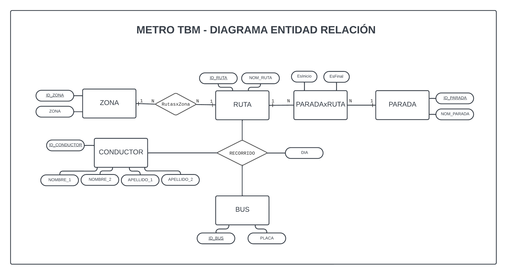
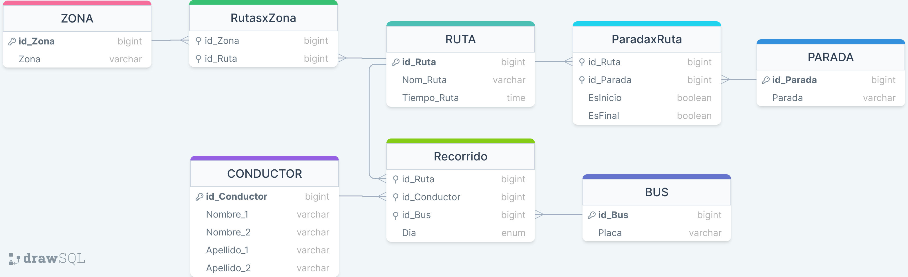

#EXAMEN_BD_TBM

#### *Problematica*
Usted ha sido contratado por el consorcio TBM, Transporte-Bucaramanga-Metropolitana para construir una solución informática que ayude a los gestores del nuevo sistema de transporte a planear sus rutas de viaje, de manera eficiente.

Elabore EL DIAGRAMA E-R y EL MODELO RELACIONAL normalizado al menos hasta su TERCERA FORMA NORMAL. Entregar Imágenes de los diagramas solicitados, scripts de generación del modelo físico normalizado, Scripts de las consultas para resolver correctamente los 10 puntos anteriores.

---
#### *Diagrama Entidad-Relación*
A continuación, se presenta el diagrama Entidad - Relación propuesto para la solución a la problematica:


---
#### *Modelo Relacional*
Basados en el diagrama Entidad-Relación planteado, se realizó el siguiente modelo relacional para dar inicio a la construcción de la Base de datos.


---
#### *Modelo Fisico de Datos*
El siguiente bloque de codigo crea la Base de datos mysql junto con sus respectivas tablas basadas en el modelo relacional, y la pobla con los datos adjuntos en el requerimiento del proyecto:
```sql
DROP DATABASE IF EXISTS METRO_TBM;
CREATE DATABASE METRO_TBM;
USE METRO_TBM;
DROP TABLE IF EXISTS ZONA;
CREATE TABLE ZONA (
    id_Zona int NOT NULL AUTO_INCREMENT,
    Zona varchar(32) NOT NULL,
    PRIMARY KEY (id_Zona)
    );
INSERT INTO ZONA (Zona) 
VALUES ("Norte"), ("Sur"), ("Oriente"), ("Occidente"), ("Floridablanca"), ("Girón"), ("Piedecuesta");

DROP TABLES IF EXISTS BUS;
CREATE TABLE BUS (
    id_Bus int NOT NULL AUTO_INCREMENT,
    Placa VARCHAR(8) NOT NULL,
    PRIMARY KEY (id_Bus)
);
INSERT INTO BUS (Placa)
VALUES ("XVH345"), ("XDL965"), ("XFG847"), ("XRJ452"), ("XDF459"), ("XET554"), ("XKL688"), ("XXL757");

DROP TABLE IF EXISTS RUTA;
CREATE TABLE RUTA (
    id_Ruta int NOT NULL AUTO_INCREMENT,
    Nom_Ruta VARCHAR(32) NOT NULL,
    Tiempo_Ruta TIME NOT NULL,
    PRIMARY KEY (id_Ruta)
);
INSERT INTO RUTA (Nom_Ruta, Tiempo_Ruta)
VALUES ("Universidades", '2:00:00'), ("Café Madrid", '2:15:00'), ("Cacique", '1:45:00'), ("Diamantes", '1:50:00'), ("Terminal", '2:00:00'), ("Prado", '1:30:00'), ("Cabecera", '2:00:00'), ("Ciudadela", '2:00:00'), ("Punta Estrella", '2:30:00'), ("Niza", '2:45:00'), ("Autopista", '2:15:00'), ("Lagos", '2:15:00'), ("Centro Florida", '2:30:00');

DROP TABLE IF EXISTS PARADA;
CREATE TABLE PARADA (
    id_Parada int NOT NULL AUTO_INCREMENT,
    Nom_Parada VARCHAR(32) NOT NULL,
    PRIMARY KEY (id_Parada)
);
INSERT INTO PARADA(Nom_Parada)
VALUES ("Colseguros"), ("Clínica Chicamocha"), ("Plaza Guarín"), ("Mega Mall"), ("UIS"), ("UDI"), ("Santo Tomás"), ("Boulevard Santander"), ("Búcaros"), ("Rosita"), ("Puerta del Sol"), ("Cacique"), ("Plaza Satélite"), ("La Sirena"), ("Provenza"), ("Fontana"), ("Gibraltar"), ("Terminal"), ("Mutis"), ("Plaza Real");

DROP TABLE IF EXISTS CONDUCTOR;
CREATE TABLE CONDUCTOR (
    id_Conductor int NOT NULL AUTO_INCREMENT,
    Nombre_1 VARCHAR(32),
    Nombre_2 VARCHAR(32),
    Apellido_1 VARCHAR(32),
    Apellido_2 VARCHAR(32),
    PRIMARY KEY(id_Conductor)
);
INSERT INTO CONDUCTOR(Nombre_1, Nombre_2, Apellido_1, Apellido_2)
VALUES ("Andés", "Manuel", "López", "Obrador"), ("Nicolás", NULL, "Maduro", "Moros"), ("Alberto", NULL, "Fernández", NULL), ("Luiz", "Inácio", "Lula", "da Silva"), ("Gabriel", NULL, "Boric", NULL), ("Miguel", NULL, "Díaz", "Canel"), ("Daniel", NULL, "Ortega", NULL), ("Gustavo", NULL, "Petro", "Urrego"), ("Luis", NULL, "Arce", NULL), ("Xiomara", NULL, "Castro", NULL);

DROP TABLE IF EXISTS Rutas_Zona;
CREATE TABLE Rutas_Zona (
    id_Zona int NOT NULL,
    id_Ruta int NOT NULL,
    FOREIGN KEY (id_Ruta) REFERENCES RUTA (id_Ruta),
    FOREIGN KEY (id_Zona) REFERENCES ZONA (id_Zona),
    CONSTRAINT ZonaRuta UNIQUE (id_Ruta, id_Zona)
);
INSERT INTO Rutas_Zona
VALUES (1,1), (1,2), (4,4), (4,5), (5,10), (5,11), (5,12);

DROP TABLE IF EXISTS Paradas_Ruta;
CREATE TABLE Paradas_Ruta (
    id_Ruta int NOT NULL,
    id_Parada int NOT NULL,
    EsInicio BOOLEAN,
    EsFinal BOOLEAN,
    FOREIGN KEY (id_Ruta) REFERENCES RUTA (id_Ruta),
    FOREIGN KEY (id_Parada) REFERENCES PARADA (id_Parada)
);
INSERT INTO Paradas_Ruta
VALUES (1,1,TRUE,FALSE),(1,2,FALSE,FALSE),(1,3,FALSE,FALSE),(1,4,FALSE,FALSE),(1,5,FALSE,FALSE),(1,6,FALSE,FALSE),(1,7,FALSE,TRUE),(3,8,TRUE,FALSE),(3,9,FALSE,FALSE),(3,10,FALSE,FALSE),(3,11,FALSE,FALSE),(3,12,FALSE,TRUE),(4,13,TRUE,FALSE),(4,14,FALSE,FALSE),(4,15,FALSE,TRUE),(5,16,TRUE,FALSE),(5,17,FALSE,TRUE),(8,18,TRUE,FALSE),(8,19,FALSE,FALSE),(8,20,FALSE,TRUE);

DROP TABLE IF EXISTS RECORRIDO;
CREATE TABLE RECORRIDO (
    id_Conductor int NOT NULL,
    id_Ruta int NOT NULL,
    id_Bus int NOT NULL,
    Dia ENUM('Lunes', 'Martes', 'Miercoles', 'Jueves', 'Viernes', 'Sabado', 'Domingo'),
        FOREIGN KEY (id_Conductor) REFERENCES CONDUCTOR (id_Conductor),
    FOREIGN KEY (id_Ruta) REFERENCES RUTA (id_Ruta),
    FOREIGN KEY (id_Bus) REFERENCES BUS (id_Bus),
    CONSTRAINT Conductor_Dia UNIQUE (id_Conductor, Dia)
);
INSERT INTO RECORRIDO
VALUES (5, 1, 1, 1), (5, 1, 1, 2), (5, 1, 3, 3), (5, 1, 3, 4), (5, 2, 5, 5), (5, 2, 5, 6), (5, 2, 5, 7), (3, 4, 5, 1), (3, 4, 6, 2), (3, 4, 1, 3), (3, 5, 1, 4), (3, 5, 3, 5), (3, 5, 3, 6), (3, 5, 3, 7), (10, 10, 3, 1 ), (10, 10, 3, 2), (10, 10, 5, 3), (10, 10, 5, 4), (10, 10, 4, 5), (10, 11, 7, 6), (10, 11, 7, 7), (7, 11, 7, 1), (7, 11, 7, 2), (6, 12, 7, 3), (6, 12, 7, 4), (6, 12, 7, 5), (6, 12, 6, 6), (6, 12, 6, 7);

```
---
#### *Consultas en la Base de Datos*
1. Cantidad de Paradas por Ruta
```sql
SELECT R.Nom_Ruta AS RUTA, COUNT(*) AS CANTIDAD_PARADAS FROM Paradas_Ruta PR INNER JOIN RUTA R ON PR.id_Ruta=R.id_Ruta GROUP BY PR.id_Ruta;
```
| RUTA          | CANTIDAD_PARADAS |
|---------------|------------------|
| Universidades |                7 |
| Cacique       |                5 |
| Diamantes     |                3 |
| Terminal      |                2 |
| Ciudadela     |                3 |


2. Nombre de las Paradas de la Ruta Universidades
```sql
SELECT P.Nom_Parada AS PARADAS_RUTA_UNIVERSIDADES FROM Paradas_Ruta PR INNER JOIN PARADA P ON PR.id_Parada=P.id_Parada WHERE PR.id_Ruta=1;
```
| PARADAS_RUTA_UNIVERSIDADES |
|----------------------------|
| Colseguros                 |
| Clínica Chicamocha         |
| Plaza Guarín               |
| Mega Mall                  |
| UIS                        |
| UDI                        |
| Santo Tomás                |

3. Nombres de las Rutas No Programadas
```sql
SELECT R.Nom_Ruta AS RUTAS_NO_PROGRAMADAS FROM RUTA R WHERE R.id_Ruta NOT IN (SELECT id_Ruta FROM RECORRIDO); 
```
| RUTAS_NO_PROGRAMADAS |
|----------------------|
| Cacique              |
| Prado                |
| Cabecera             |
| Ciudadela            |
| Punta Estrella       |
| Centro Florida       |

4. Rutas Programadas sin Conductor Asignado
```sql
SELECT R.Nom_Ruta AS RUTAS_PROGRAMADAS_SIN_CONDUCTOR FROM RUTA R INNER JOIN RECORRIDO Re ON Re.id_Ruta=R.id_Ruta WHERE Re.id_Conductor=NULL;
```
| RUTAS_PROGRAMADAS_SIN_CONDUCTOR |
|---------------------------------|

5. Conductores No Asignados a la Programación
```sql
SELECT id_Conductor, CONCAT(Nombre_1, ' ', IFNULL(Nombre_2,''), ' ', Apellido_1, ' ', IFNULL(Apellido_2,'')) AS CONDUCTORES_NO_PROGRAMADOS FROM CONDUCTOR WHERE id_Conductor NOT IN (SELECT id_Conductor FROM RECORRIDO); 
```
| id_Conductor | CONDUCTORES_NO_PROGRAMADOS   |
|--------------|------------------------------|
|            1 | Andés Manuel López Obrador   |
|            2 | Nicolás  Maduro Moros        |
|            4 | Luiz Inácio Lula da Silva    |
|            8 | Gustavo  Petro Urrego        |
|            9 | Luis  Arce                   |

6. Buses No asignados a la Programación
```sql
SELECT B.id_Bus, B.Placa FROM BUS B WHERE B.id_Bus NOT IN (SELECT id_Bus FROM RECORRIDO);  
```
| id_Bus | Placa  |
|--------|--------|
|      2 | XDL965 |
|      8 | XXL757 |

7. Zonas NO Programadas
```sql
SELECT Z.id_Zona, Z.Zona FROM ZONA Z WHERE Z.id_Zona NOT IN (SELECT Z.id_Zona FROM ZONA Z INNER JOIN Rutas_Zona RZ ON RZ.id_Zona=Z.id_Zona LEFT JOIN RECORRIDO RE ON RE.id_Ruta=RZ.id_Ruta);   
```
| id_Zona | Zona        |
|---------|-------------|
|       2 | Sur         |
|       3 | Oriente     |
|       6 | Girón       |
|       7 | Piedecuesta |

8. Programación asignada a cada conductor (Conductor, Ruta y Día)
```sql
SELECT CONCAT(C.Nombre_1, ' ', IFNULL(C.Nombre_2,''), ' ', C.Apellido_1, ' ', IFNULL(C.Apellido_2,'')) AS CONDUCTOR, R.Nom_Ruta, Re.Dia FROM CONDUCTOR C INNER JOIN RECORRIDO Re ON Re.id_Conductor=C.id_Conductor INNER JOIN RUTA R ON R.id_Ruta=Re.id_Ruta; 
```
| CONDUCTOR            | Nom_Ruta      | Dia       |
|----------------------|---------------|-----------|
| Gabriel  Boric       | Universidades | Lunes     |
| Gabriel  Boric       | Universidades | Martes    |
| Gabriel  Boric       | Universidades | Miercoles |
| Gabriel  Boric       | Universidades | Jueves    |
| Gabriel  Boric       | Café Madrid   | Viernes   |
| Gabriel  Boric       | Café Madrid   | Sabado    |
| Gabriel  Boric       | Café Madrid   | Domingo   |
| Alberto  Fernández   | Diamantes     | Lunes     |
| Alberto  Fernández   | Diamantes     | Martes    |
| Alberto  Fernández   | Diamantes     | Miercoles |
| Alberto  Fernández   | Terminal      | Jueves    |
| Alberto  Fernández   | Terminal      | Viernes   |
| Alberto  Fernández   | Terminal      | Sabado    |
| Alberto  Fernández   | Terminal      | Domingo   |
| Xiomara  Castro      | Niza          | Lunes     |
| Xiomara  Castro      | Niza          | Martes    |
| Xiomara  Castro      | Niza          | Miercoles |
| Xiomara  Castro      | Niza          | Jueves    |
| Xiomara  Castro      | Niza          | Viernes   |
| Xiomara  Castro      | Autopista     | Sabado    |
| Xiomara  Castro      | Autopista     | Domingo   |
| Daniel  Ortega       | Autopista     | Lunes     |
| Daniel  Ortega       | Autopista     | Martes    |
| Miguel  Díaz Canel   | Lagos         | Miercoles |
| Miguel  Díaz Canel   | Lagos         | Jueves    |
| Miguel  Díaz Canel   | Lagos         | Viernes   |
| Miguel  Díaz Canel   | Lagos         | Sabado    |
| Miguel  Díaz Canel   | Lagos         | Domingo   |

9. Programación asignada a conductores que hacen rutas de más de dos horas
```sql
SELECT CONCAT(C.Nombre_1, ' ', IFNULL(C.Nombre_2,''), ' ', C.Apellido_1, ' ', IFNULL(C.Apellido_2,'')) AS CONDUCTOR, R.Nom_Ruta, Re.Dia FROM CONDUCTOR C INNER JOIN RECORRIDO Re ON Re.id_Conductor=C.id_Conductor INNER JOIN RUTA R ON R.id_Ruta=Re.id_Ruta WHERE R.Tiempo_Ruta>'2:00:00';
```
| CONDUCTOR           | Nom_Ruta     | Dia       |
|---------------------|--------------|-----------|
| Gabriel  Boric      | Café Madrid  | Viernes   |
| Gabriel  Boric      | Café Madrid  | Sabado    |
| Gabriel  Boric      | Café Madrid  | Domingo   |
| Xiomara  Castro     | Niza         | Lunes     |
| Xiomara  Castro     | Niza         | Martes    |
| Xiomara  Castro     | Niza         | Miercoles |
| Xiomara  Castro     | Niza         | Jueves    |
| Xiomara  Castro     | Niza         | Viernes   |
| Xiomara  Castro     | Autopista    | Sabado    |
| Xiomara  Castro     | Autopista    | Domingo   |
| Daniel  Ortega      | Autopista    | Lunes     |
| Daniel  Ortega      | Autopista    | Martes    |
| Miguel  Díaz Canel  | Lagos        | Miercoles |
| Miguel  Díaz Canel  | Lagos        | Jueves    |
| Miguel  Díaz Canel  | Lagos        | Viernes   |
| Miguel  Díaz Canel  | Lagos        | Sabado    |
| Miguel  Díaz Canel  | Lagos        | Domingo   |

10. Nombres de Zonas y cantidad de rutas que tienen programadas (Contar)
```sql
SELECT Z.id_Zona, Z.Zona, COUNT(*) AS RUTAS_PROGRAMADAS FROM ZONA Z LEFT JOIN Rutas_Zona RZ ON RZ.id_Zona=Z.id_Zona LEFT JOIN RECORRIDO Re ON RZ.id_Ruta=Re.id_Ruta GROUP BY Z.id_Zona;
```
| id_Zona | Zona          | RUTAS_PROGRAMADAS |
|---------|---------------|-------------------|
|       1 | Norte         |                 7 |
|       2 | Sur           |                 1 |
|       3 | Oriente       |                 1 |
|       4 | Occidente     |                 7 |
|       5 | Floridablanca |                14 |
|       6 | Girón         |                 1 |
|       7 | Piedecuesta   |                 1 |
